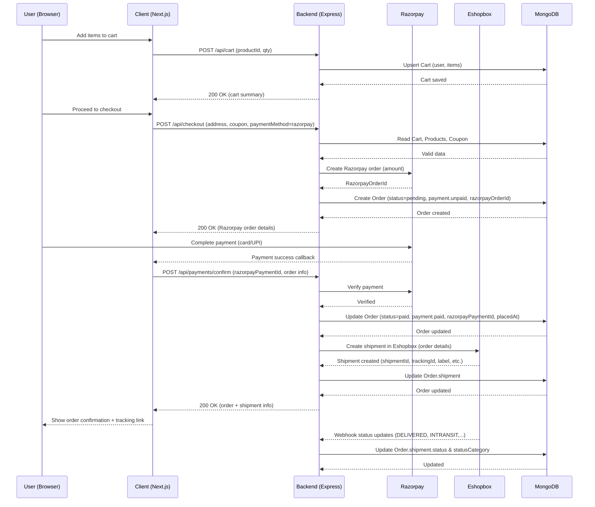
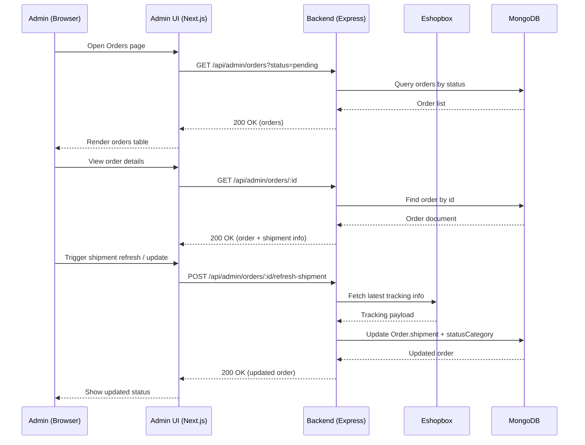
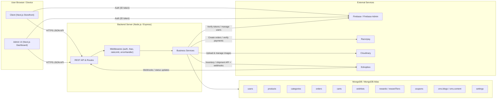
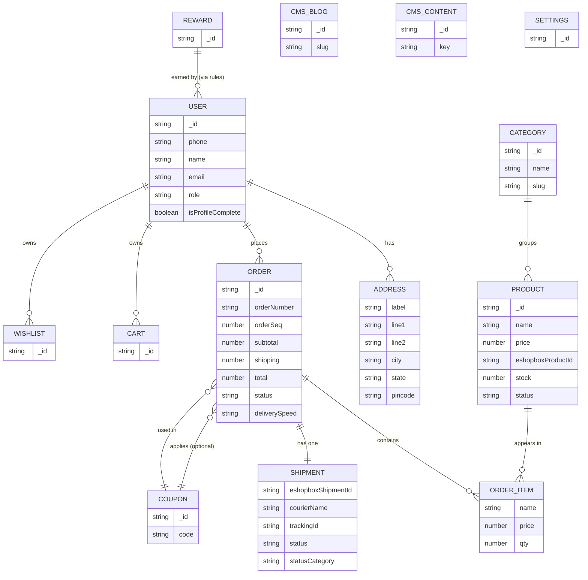
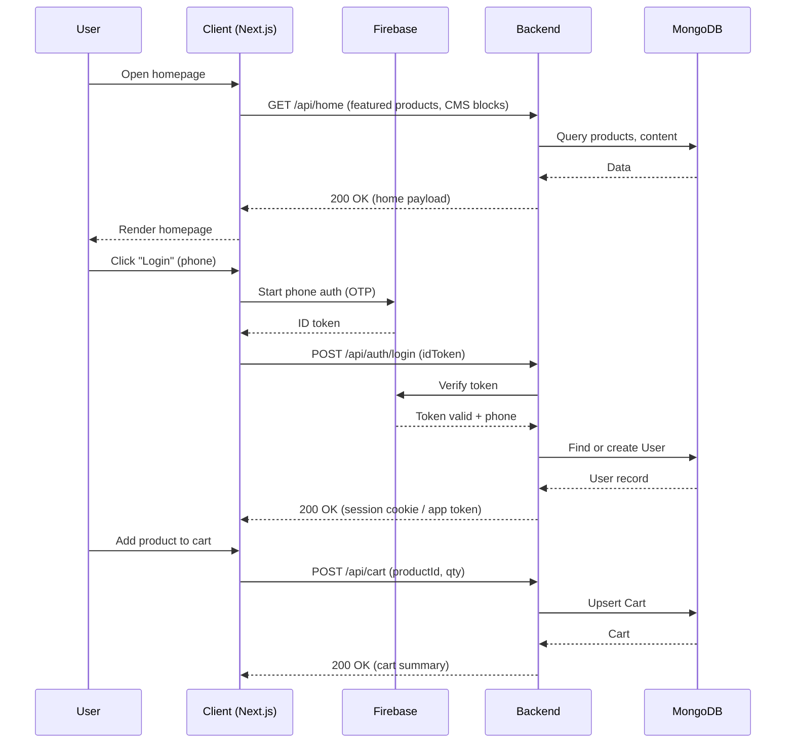
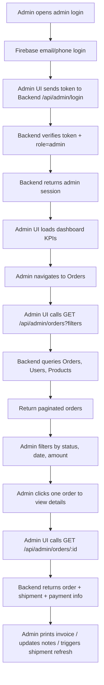
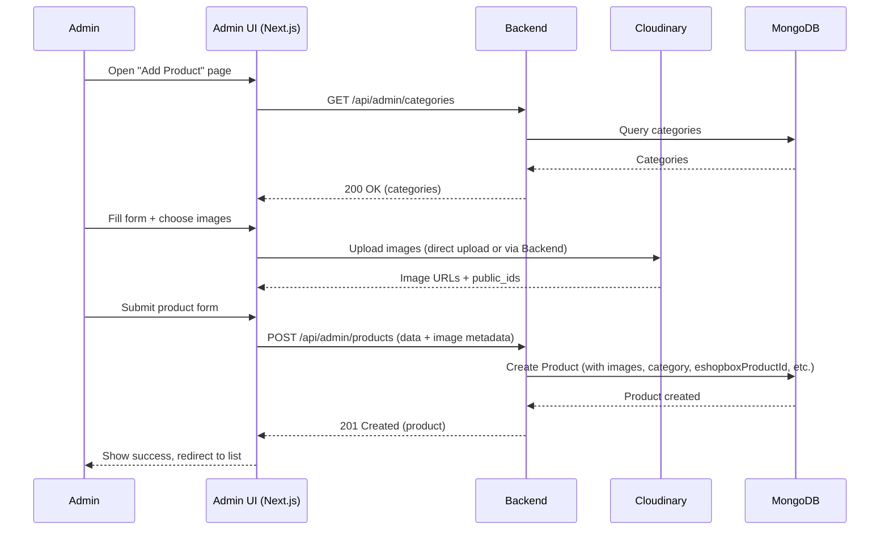

# Wild & Root (WNR) – System Thesis

> This document explains the overall architecture, data model, and runtime behaviour of the WNR codebase (client + admin UI + backend). It is written so that a new engineer can understand, modify, and extend the system.

---

## 1. High‑Level Architecture

The WNR system is a **three‑part web application**:

- **Client** (`client/`): Public customer‑facing Next.js app (storefront). Users browse products, manage cart, place orders, manage addresses, and view their profile.
- **Admin UI** (`adminui/`): Internal Next.js dashboard for admins to manage catalog (products, categories), content (blogs, testimonials), orders, coupons, rewards, and site settings.
- **Backend API** (`backend/`): Node.js + Express + MongoDB (via Mongoose) service that exposes RESTful APIs used by both Client and Admin UI.

**Integrations**:

- **Firebase**: Used for authentication (primarily phone‑based via OTP) and user identity.
- **Razorpay**: Used for online payment processing.
- **Cloudinary**: Used to store and serve images (product images, banners, etc.).
- **Eshopbox**: 3PL / fulfillment integration for inventory, orders, and shipment tracking.
- **MongoDB Atlas** (or local MongoDB): Primary database for all persistent entities (users, products, orders, etc.).

The overall runtime picture is:

1. Browser (Client or Admin UI) calls **Backend REST APIs** with JSON over HTTP(S), attaching cookies or auth tokens.
2. Backend authenticates user/admin, executes business logic, reads/writes MongoDB via Mongoose models, and returns JSON responses.
3. For some flows (checkout, orders), backend calls **Razorpay** and **Eshopbox** and stores their identifiers and statuses.
4. Static assets (images) are stored in **Cloudinary**, with only URLs stored in MongoDB.

---

## 2. Backend Overview

**Entry point**: `backend/dist/server.js` (built from `src/server.ts`).

Key responsibilities:

- Load environment variables using `dotenv`.
- Initialize Express app and middleware (CORS, cookies, JSON parsing, static files).
- Mount all route modules under `/` and specific integration routes under `/api/webhooks/eshopbox`.
- Connect to MongoDB via `lib/db` with retry logic and connection monitoring.
- Initialize Eshopbox token refresh background job.
- Start HTTP server and handle graceful shutdown signals.

Core components:

- **Routes** (`backend/dist/routes/*.js`, `backend/dist/modules/**/**.routes.js`)
  - Each route file defines Express routers for a specific feature area (auth, users, cart, orders, products, categories, coupons, rewards, CMS, etc.).
  - Public client APIs are usually under `/api/...`, admin APIs typically under `/api/admin/...` or similar prefixes.

- **Controllers & Services** (`backend/dist/modules/**/controller.js`, `.../service.js`)
  - Controllers are thin Express handlers responsible for request validation, calling services, and shaping HTTP responses.
  - Services implement the **business logic**, interacting with Mongoose models and external APIs.

- **Models** (`backend/dist/modules/**/**.model.js`, `User.js`, `Order.js`, `Cart.js`, etc.)
  - Mongoose schemas and models for each collection.
  - Use indexes heavily for performance (especially on Atlas).

- **Middlewares** (`backend/dist/middlewares/*.js`)
  - `auth.js` / `userAuth.js`: Verify user authentication (e.g., Firebase token, JWT, or session cookie) and attach user to `req`.
  - `rbac.js`: Role‑based access control for admin routes.
  - `rateLimit.js`: Throttle requests from abusive clients.
  - `cors.js`: CORS configuration helper (or logic embedded directly in `server.js`).
  - `notFound.js` / `errorHandler.js`: Handle 404 and centralized error formatting.

- **Libs** (`backend/dist/lib/*.js`)
  - `db.js`: MongoDB connection management.
  - `logger.js`: Structured logging.
  - `env.js`: Environment variable helpers.
  - `errors.js`: Custom error classes.
  - `session.js`: Session handling helpers.
  - `encryption.js`: If present, used for secure storage of sensitive data.
  - `upload.js` / `cloudinary.js`: File upload and Cloudinary integration.
  - `eshopbox.js`, `eshopbox-webhook-register.js`: Eshopbox integration helpers.

- **Jobs** (`backend/dist/jobs/*.js`)
  - `eshopbox-token-refresh.js`: Background job to refresh Eshopbox access tokens on schedule.

---

## 3. Database Structure (MongoDB via Mongoose)

The backend uses **MongoDB** with collections modeled as **Mongoose schemas**. Below is an overview of the most important entities.

### 3.1 Core Entities

#### 3.1.1 User (`modules/users/User.js`)

- **Collection**: `users`
- **Fields**:
  - `phone: string` (required, unique, indexed) – primary login identifier.
  - `name: string`
  - `email: string` – unique if non‑empty (partial index to skip blank/null values).
  - `avatarUrl: string`
  - `role: "user" | "admin"` (default: `user`).
  - `isProfileComplete: boolean`.
  - `provider: string` – e.g. `firebase-phone`.
  - `meta: { city?: string; dob?: string }` – miscellaneous profile metadata.
  - `lastLoginAt: Date | null`.
  - `addresses: Address[]` – embedded array of address objects.

- **Embedded Address schema** (`AddressSchema`):
  - `label: "Home" | "Work" | "Other"` (default: `Home`).
  - `line1: string`
  - `line2?: string`
  - `city: string`
  - `state: string` – state code (e.g., `"GJ"`).
  - `pincode: string` – 6‑digit code as string.

- **Indexes & Hooks**:
  - Unique index on `email` with `partialFilterExpression` to avoid conflicts on empty strings.
  - `pre("save")` hook ensures blank emails are not persisted (`email` set to `undefined`).

#### 3.1.2 Product (`modules/catalog/products/product.model.js`)

- **Collection**: `products`
- **Fields**:
  - `name: string` (required, trimmed, minLength: 1).
  - `price: number` (required,  0).
  - `eshopboxProductId: string` (required, unique) – cross‑system ID used with Eshopbox.
  - `category: ObjectId<Category>` (required) – reference to a Category.
  - `stock: number` (required,  0).
  - `status: "active" | "inactive" | "draft"` (default: `active`, indexed).
  - `images: Image[]` (required; 3–5 images validated).
  - `hover?: Image` – separate image for hover effects.
  - `about?: string` – marketing description.
  - `ingredients?: string` – product ingredients.
  - `description?: string`
  - `descriptionPoints?: string[]` – bullet points; validated to be an array when present.

- **Embedded Image schema**:
  - `url: string` (required) – typically Cloudinary URL.
  - `public_id: string` (required) – Cloudinary public ID.
  - `width?: number`, `height?: number`, `format?: string`, `bytes?: number`, `alt?: string`.

- **Indexes**:
  - `{ name: 1, category: 1 }` – compound index for searching by name within a category.
  - `{ status: 1, category: 1 }` – for listing active products by category.
  - `{ eshopboxProductId: 1 }` (unique) – enforce unique mapping.
  - `{ createdAt: -1 }` – sort by newest.
  - `{ price: 1 }` – price range queries.
  - `{ stock: 1 }` – for internal stock management.
  - **Text index** `{ name: "text", description: "text", about: "text" }` – full‑text search.

#### 3.1.3 Category (`modules/catalog/categories/category.model.js`)

- **Collection**: `categories`
- **Fields** (typical, inferred from product relations and e‑commerce conventions):
  - `name: string`
  - `slug: string` (often unique).
  - `description?: string`
  - `parent?: ObjectId<Category>` – for subcategories.
  - `image?: Image` – optional category image.

> Exact fields may include additional marketing or SEO metadata; refer to `category.model.js` for specifics.

#### 3.1.4 Order (`modules/orders/Order.js`)

- **Collection**: `orders`

- **Embedded `OrderItem` schema**:
  - `product: ObjectId<Product>` (required) – reference snapshot.
  - `name: string` (required) – product name at time of purchase.
  - `price: number` (required,  0) – price at purchase time.
  - `qty: number` (required,  1).

- **Embedded `ShipmentSubSchema`** (Eshopbox shipment metadata):
  - `eshopboxShipmentId?: string`
  - `courierName?: string`
  - `trackingId?: string`
  - `labelUrl?: string`
  - `routingCode?: string`
  - `shippingMode?: string`
  - `gstin?: string`
  - `transporterID?: string`
  - `status?: string` – raw Eshopbox status (e.g., `DELIVERED`, `INTRANSIT`).
  - `latest_status?: string`
  - `status_updated_at?: string`
  - `statusDescription?: string`
  - `statusCategory?: "pending" | "in-transit" | "delivered" | "issue"`
  - `raw?: any` – full raw Eshopbox payload.
  - `createdAt: Date` (default now).
  - `updatedAt: Date` (default now).

- **Order schema fields**:
  - `user: ObjectId<User>` (required, indexed) – who placed the order.
  - `orderNumber: string` (required, unique, indexed) – human‑friendly ID (e.g. `WNR_0001`).
  - `orderSeq: number` (required, unique, indexed) – monotonically increasing sequence.
  - `items: OrderItem[]` (required).
  - `subtotal: number` (required).
  - `shipping: number` (required).
  - `total: number` (required).
  - `status: "pending" | "paid" | "failed" | "cancelled"` (default: `pending`).
  - `deliverySpeed: "standard" | "express" | "prime"` (default: `standard`).
  - `coupon?: { code?: string; name?: string; discountType?: "percentage" | "fixed"; discountValue?: number; discountAmount?: number }`.
  - `addressSnapshot: { name: string; phone: string; line1: string; line2?: string; city: string; state: string; pincode: string }` – copied from user address at order time.
  - `payment: { method: "razorpay" | "cod"; status: "unpaid" | "paid" | "failed"; razorpayOrderId?: string; razorpayPaymentId?: string }`.
  - `placedAt?: Date` – timestamp when order is confirmed.
  - `shipment?: ShipmentSubSchema` – tracking info.

- **Indexes (Atlas‑optimized)**:
  - `{ user: 1, createdAt: -1 }` – user order history sorted by time.
  - `{ user: 1, status: 1, createdAt: -1 }` – user orders filtered by status.
  - `{ "payment.razorpayOrderId": 1 }` (unique, sparse) – payment lookup.
  - `{ "payment.razorpayPaymentId": 1 }` (unique, sparse) – payment lookup.
  - `{ status: 1, createdAt: -1 }` – admin order lists by status.
  - `{ createdAt: -1 }` – general sorting.
  - `{ orderNumber: 1 }` (unique) – direct lookup.
  - `{ orderSeq: 1 }` (unique) – internal sequence.
  - `{ "shipment.trackingId": 1 }` – tracking lookup.
  - `{ "shipment.eshopboxShipmentId": 1 }` – Eshopbox tracking.
  - `{ placedAt: -1 }` – date‑based queries.

#### 3.1.5 Cart (`modules/cart/Cart.js`)

- **Collection**: `carts`
- **Typical fields** (based on common e‑commerce patterns and other models):
  - `user: ObjectId<User>` – owner.
  - `items: [{ product: ObjectId<Product>, qty: number, price: number, ... }]`.
  - Possibly fields for `coupon`, `subtotal`, etc. (exact structure in `Cart.js`).

#### 3.1.6 Wishlist (`modules/wishlist/Wishlist.js`)

- **Collection**: `wishlists`
- **Typical fields**:
  - `user: ObjectId<User>`.
  - `products: ObjectId<Product>[]`.

#### 3.1.7 Counters (`modules/counters/Counter.js`)

- Maintains **sequence numbers** (e.g. for `orderSeq`) using an atomic document per sequence key.
- Common pattern:
  - `_id: string` – sequence name (e.g. `"order"`).
  - `seq: number` – last used number.

#### 3.1.8 Rewards & Coupons

- **Rewards** (`modules/rewards/*.model.js`):
  - `Reward` and `RewardTier` models store loyalty programs.
  - Fields typically include tier name, thresholds, points earned, and mapping from orders to rewards.

- **Coupons** (`modules/coupons/coupon.model.js`):
  - Fields likely include `code`, `name`, `discountType`, `discountValue`, `startDate`, `endDate`, `usageLimit`, `perUserLimit`, and conditions like minimum order value.

#### 3.1.9 CMS Content & Logs

- **CMS Blog** (`modules/cms/blog/model.js`):
  - Blog posts with title, slug, body, author, tags, published status, timestamps.

- **CMS Content** (`modules/cms/content/content.model.js`):
  - Generic content blocks for static sections (banners, home page sections, etc.).

- **Logs** (`modules/logs/log.model.js`):
  - Stores structured logs or audit entries (user actions, system events).

#### 3.1.10 Settings (`modules/settings/settings.model.js`)

- Global site configuration:
  - Feature flags, marketing banners, SEO defaults, shipping rules, etc.

---

## 4. Database Structure – Conceptual ER View

Below is a conceptual entity‑relationship description (not SQL, but helpful mentally):

- **User (1) — (N) Order**
  - Each order belongs to a user; users can have many orders.

- **User (1) — (1) Cart** (typical)
  - Each user has a single active cart (or one per channel).

- **User (1) — (N) Wishlist** or **(1) — (1) Wishlist** (depending on implementation)
  - A wishlist references many products.

- **Product (1) — (N) OrderItem**
  - An order item references one product; products can exist in many orders.

- **Category (1) — (N) Product**
  - Each product has one category; categories contain many products.

- **Order (1) — (1) ShipmentSubSchema**
  - Shipment info is embedded in the order.

- **Order (1) — (0..1) Coupon**
  - Optional coupon info embedded.

- **Settings / Rewards / Coupons / CMS**
  - Mostly independent collections referenced by code using IDs or slugs.

---

## 5. Key Backend Flows

### 5.1 User Authentication (Phone + Firebase)

1. Client triggers Firebase phone auth (OTP) on frontend.
2. Firebase returns an ID token to the client.
3. Client sends this token to backend auth route (`/api/auth/login` or similar).
4. Backend verifies token with `firebase-admin`.
5. Backend looks up `User` by phone; if not found, creates a new user document.
6. Backend issues a session (cookie/JWT) or returns a signed token for subsequent authenticated requests.

### 5.2 Browsing Catalog

1. Client calls product listing endpoint (`GET /api/products`), optionally with filters (category, search text, pagination).
2. Backend queries `Product` collection using:
   - `status: "active"`.
   - Text search index for search queries.
   - Category and price filters, with sorting (e.g., by `createdAt` or `price`).
3. Backend returns product list with essential fields (name, price, images, stock availability).

### 5.3 Cart Management

1. User adds item to cart on client → `POST /api/cart` with `productId` and `qty`.
2. Backend finds/creates `Cart` for the user.
3. Adds or updates an item in `Cart.items`, recalculates totals, and persists.
4. Client fetches cart details via `GET /api/cart` for display.

### 5.4 Checkout & Order Creation

High‑level flow:

1. **Cart Review**
   - Client calls `GET /api/cart` to display items, prices, and totals.

2. **Address Selection**
   - Client either selects an existing saved address or creates a new one under `User.addresses`.

3. **Coupon Application (if any)**
   - Client calls `POST /api/coupons/apply` or similar with `code` and cart summary.
   - Backend validates coupon against rules and returns discounted totals.

4. **Order Pre‑Creation & Razorpay Order**
   - Client initiates checkout via `POST /api/checkout`.
   - Backend:
     - Validates cart and stock.
     - Reserves/locks items (implementation‑specific).
     - Creates a Razorpay order via `razorpay` SDK (for online payments).
     - Creates/updates an `Order` document with `status = "pending"`, `payment.status = "unpaid"`, and `payment.razorpayOrderId`.

5. **Payment & Confirmation**
   - Client completes payment using Razorpay on frontend.
   - Confirmation event is sent to backend (either via webhook or client callback with `razorpayPaymentId`).
   - Backend verifies payment (signature, status) and updates `Order`:
     - `status = "paid"`.
     - `payment.status = "paid"`.
     - `payment.razorpayPaymentId` set.
     - `placedAt` set to current timestamp.

6. **Shipment Creation & Eshopbox Integration**
   - After order confirmation, backend sends order details to Eshopbox to create shipment.
   - Stores `ShipmentSubSchema` data on `Order` (ID, tracking ID, courier, label URL, etc.).

### 5.5 Shipment Tracking (Eshopbox)

1. Eshopbox sends webhooks to `/api/webhooks/eshopbox` upon shipment status changes.
2. Route handler parses payload and finds `Order` by shipment ID or tracking ID.
3. Updates `Order.shipment` fields and possibly `statusCategory`.
4. Client/Admin UI polls or queries orders to show live shipment status.

---

## 6. Backend Activity Diagram – "Place Order" Flow

The following Mermaid activity diagram summarizes the typical user checkout and order placement process.

```mermaid
flowchart TD
  A[User browses products] --> B[User adds items to cart]
  B --> C[User opens cart page]
  C --> D[Client calls GET /api/cart]
  D --> E[Backend loads Cart for user]
  E --> F[Cart returned to client]
  F --> G[User proceeds to checkout]
  G --> H[Client sends address + coupon to POST /api/checkout]
  H --> I[Backend validates cart, stock, coupon]
  I --> J{Payment method?}
  J -->|Online (Razorpay)| K[Create Razorpay order]
  K --> L[Create Order with status=pending]
  L --> M[Return Razorpay order details to client]
  M --> N[User completes payment in Razorpay UI]
  N --> O[Backend verifies payment and updates Order]
  O --> P[Order status=paid, payment.status=paid, placedAt set]
  P --> Q[Backend notifies Eshopbox / creates shipment]
  Q --> R[Order.shipment populated]
  R --> S[Client/Admin can view order & tracking]
  J -->|COD| T[Create Order directly with method=cod]
  T --> P
```

---

## 7. Backend Sequence Diagram – "User Places Order with Razorpay & Eshopbox"

This diagram shows key interactions across components for an online payment order.



---

## 8. Frontend (Client) Overview

**Tech stack**: Next.js 15 (React 19), TypeScript, Tailwind CSS 4, Three.js (`@react-three/fiber` and `@react-three/drei`), Framer Motion, Swiper.

- **Structure**:
  - Components under `client/src/components/**` handle presentation (e.g., `home/Hero.tsx`, `three/ProductBox3D.tsx`).
  - Pages under `client/src/app` (or `pages`) define routing (home, product listing, product detail, cart, checkout, profile, etc.).

- **Responsibilities**:
  - Render marketing and product information.
  - Manage cart state (either server‑side, client‑side, or hybrid via API calls).
  - Handle user login via Firebase (phone OTP) and pass tokens or cookies to backend.
  - Drive checkout UX and interact with Razorpay UI.

- **Notable libraries**:
  - `@react-three/fiber` + `three`: 3D product box / interactive scenes.
  - `framer-motion`: Smooth animations and transitions.
  - `swiper`: Carousels for testimonials, product sliders, etc.
  - `firebase`: Client‑side auth SDK.
  - `jspdf` + `jspdf-autotable`: Generating downloadable documents (e.g. invoices, reports).

---

## 9. Frontend (Admin UI) Overview

**Tech stack**: Next.js 15 (React 19), TypeScript, Tailwind CSS, Chart.js via `react-chartjs-2`, Cloudinary client SDK.

- **Structure**:
  - Layout components (navigation, sidebar) and feature pages (orders, products, analytics, CMS content, rewards, coupons, users).
  - `Sidebar.tsx` and related components define sidebar navigation.

- **Responsibilities**:
  - Authenticate admins (via Firebase/Backend).
  - Manage catalog: create/update products and categories (with image upload to Cloudinary).
  - Manage orders: view details, filter by status, inspect shipment info.
  - Manage CMS content: blogs, testimonials, homepage sections.
  - Manage marketing and growth tools: coupons, reward tiers.
  - Visualize KPIs with charts (sales over time, top products, etc.).

---

## 10. Frontend–Backend Interaction Patterns

- **Authentication**:
  - Client and Admin UI authenticate users via Firebase, but **application‑level authorization** (roles, admin privileges) is enforced by Backend using its own `User` model (`role` field) and middlewares.

- **State Management**:
  - Most persistent state (cart, orders, wishlist) is stored in MongoDB and accessed via Backend APIs.
  - Client UIs keep temporary local state for UX (selected filters, UI layout, in‑progress forms).

- **Error Handling**:
  - Backend centralizes errors via `errorHandler` middleware, returning JSON with message and optional error codes.
  - Frontends surface these errors via toast notifications (e.g., `sonner`) or inline field errors.

---

## 11. Activity Diagram – Admin Catalog Management

This activity diagram shows how an admin manages products via the Admin UI.

```mermaid
flowchart TD
  A[Admin opens Admin UI] --> B[Navigates to Products page]
  B --> C[Admin clicks "Add Product"]
  C --> D[Admin fills form & uploads images]
  D --> E[Admin submits form]
  E --> F[Admin UI calls POST /api/admin/products]
  F --> G[Backend validates input & uploads images to Cloudinary]
  G --> H[Backend creates Product in MongoDB]
  H --> I[Backend returns created product]
  I --> J[Admin UI updates list and shows success]

  B --> K[Admin clicks "Edit" on product]
  K --> L[Admin modifies fields]
  L --> M[Admin UI calls PUT /api/admin/products/:id]
  M --> N[Backend updates Product in MongoDB]
  N --> O[UI refreshes list]
```

---

## 12. Sequence Diagram – Admin Updates Order Status / Shipment



---

## 13. How to Navigate and Extend the Codebase

### 13.1 Finding Things

- **Routes**: Start at `backend/dist/routes/index.js` to see top‑level route mounting and discover feature modules.
- **Models**: Look under `backend/dist/modules/**` for `.model.js` or capitalized `.js` files (e.g. `User.js`, `Order.js`, `Cart.js`).
- **Controllers/Services**: Look for `.controller.js` and `.service.js` siblings of models.
- **Frontend pages**: Inspect `client/src/app` (or `pages`) for route‑level components.
- **Admin pages**: Inspect `adminui/src/app` (or relevant folder) for feature routes.

### 13.2 Adding a New Feature (Example: Referral Codes)

1. **Design schema**: Add `Referral` model and/or extend `User`/`Order` with referral fields.
2. **Create APIs**: Implement routes and controllers under `backend/src/modules/referrals` for creating and applying referral codes.
3. **Update Client**: Add UI to enter referral codes on signup or checkout.
4. **Update Admin UI**: Add management pages to view referral stats.
5. **Secure endpoints**: Use `auth` and `rbac` middlewares for appropriate routes.

### 13.3 Working with Migrations & Indexes

- Backend includes a `migrate-indexes` script (`npm run migrate-indexes`) to ensure MongoDB indexes are created/updated in Atlas.
- When adding or changing indexes on a model, update the script as needed and run it in deployed environments.

---

## 14. Summary

- The WNR system is a **Node.js + Express + MongoDB backend** powering two **Next.js** frontends (Client & Admin UI) with **Firebase auth**, **Razorpay payments**, **Cloudinary images**, and **Eshopbox fulfillment**.
- Core database entities are `User`, `Product`, `Category`, `Order`, `Cart`, `Wishlist`, `Reward`, `Coupon`, `CMS` content, and `Settings`, connected with clear relationships.
- Activity and sequence diagrams in this document capture the main flows: **user checkout**, **payment + shipment**, and **admin catalog/order management**.
- To extend the system, follow the established pattern: **model → service → controller → route → frontend UI**, respecting existing auth and RBAC middlewares.

---

## 15. Complete Diagram Set (Backend, Client, Admin UI, Database)

This section collects **all major diagrams** you might need in a thesis or architecture document: one **system‑level component diagram**, one **database ER diagram**, and separate **activity + sequence diagrams** for **Client**, **Admin UI**, and **Backend** responsibilities.

### 15.1 System Component / Deployment Diagram



### 15.2 Database ER Diagram (Conceptual)



### 15.3 Client (Storefront) – Activity Diagram

```mermaid
flowchart TD
  A[User lands on homepage] --> B[Client fetches featured products, banners, CMS blocks]
  B --> C[User browses categories / search]
  C --> D[Client calls GET /api/products with filters]
  D --> E[Backend returns product list]
  E --> F[User opens product detail]
  F --> G[Client calls GET /api/products/:id]
  G --> H[Show product info, images, 3D box, reviews]
  H --> I[User adds product to cart]
  I --> J[Client calls POST /api/cart]
  J --> K[Backend updates Cart and returns summary]
  K --> L[Show cart badge + mini cart]
  L --> M[User proceeds to checkout]
  M --> N[If not authenticated → start Firebase phone login]
  N --> O[On success, client sends token to backend auth]
  O --> P[Backend validates, creates/updates User, sets session]
  P --> Q[Client reloads protected state (addresses, cart)]
```

### 15.4 Client (Storefront) – Sequence Diagram



### 15.5 Admin UI – Activity Diagram



### 15.6 Admin UI – Sequence Diagram (Product Creation)



### 15.7 Backend – Internal Module Interaction Diagram

```mermaid
flowchart TB
  R[Express Routes] --> Ctr[Controllers]
  Ctr --> Svc[Services]
  Svc --> Mod[Models (Mongoose)]
  Svc --> Lib[Libs (Cloudinary, Eshopbox, Razorpay, etc.)]
  R --> MW[Middlewares]
  MW --> Ctr
  Mod --> DB[(MongoDB)]
```

These diagrams, together with the earlier sections, give **complete, visual coverage** of how the **backend, client, admin UI, and database** work and interact. You can paste them directly into Markdown‑aware tools that support Mermaid (GitHub, GitLab, Obsidian, many documentation platforms) or export them as images for your thesis.